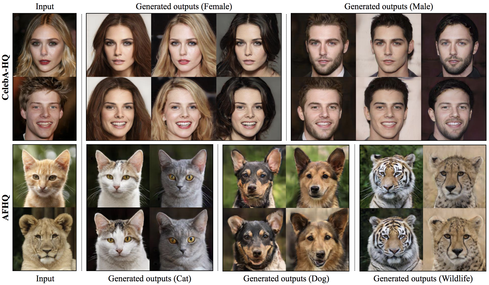
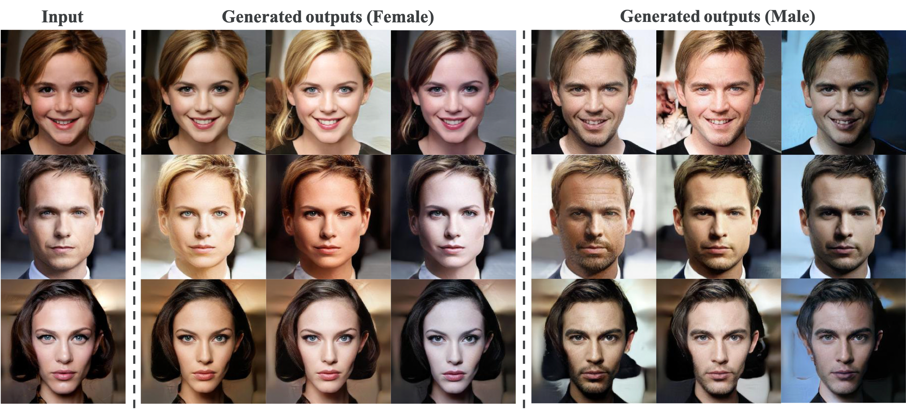
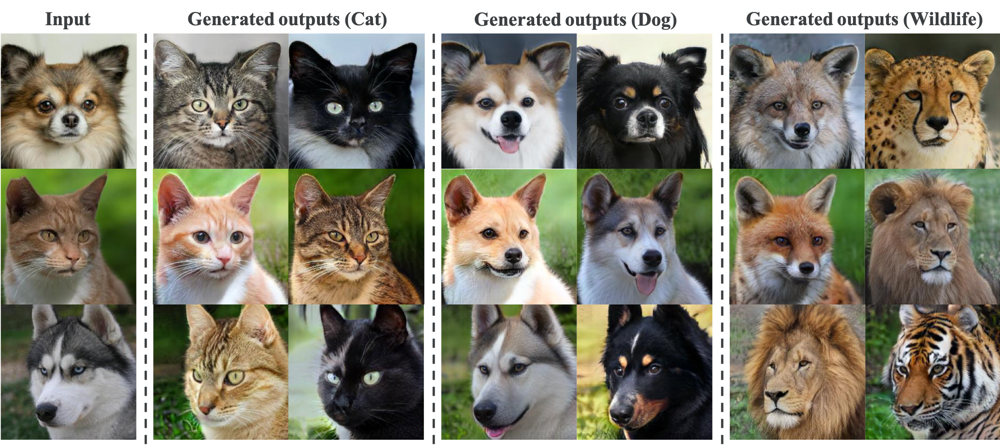

## StarGAN v2 &mdash; Official TensorFlow Implementation [[Paper]](https://arxiv.org/abs/1912.01865) [[Pytorch]](https://github.com/clovaai/stargan-v2)
## Implemented by [Junho Kim](http://bit.ly/jhkim_ai)

<div align="center">
  
</div>

## Requirements
* `Tensorflow == 2.1.0`
* `Tensorflow-addons == 0.9.1`
* `opencv-python`
* `Pillow`
* `tqdm`

## Usage
```
├── dataset
   └── YOUR_DATASET_NAME
       ├── train
           ├── domain1 (domain folder)
               ├── xxx.jpg (domain1 image)
               ├── yyy.png
               ├── ...
           ├── domain2
               ├── aaa.jpg (domain2 image)
               ├── bbb.png
               ├── ...
           ├── ...
           
       ├── test
           ├── ref_imgs (domain folder)
               ├── domain1 (domain folder)
                   ├── ttt.jpg (domain1 image)
                   ├── aaa.png
                   ├── ...
               ├── domain2
                   ├── kkk.jpg (domain2 image)
                   ├── iii.png
                   ├── ...
               ├── ...
               
           ├── src_imgs
               ├── src1.jpg 
               ├── src2.png
               ├── ...
```

### Train
```
python main.py --dataset celebA-HQ_gender --phase train
```

### Test
```
python main.py --dataset by_time_zone --phase test
```


## Tensorflow results (100K)
### Latent-guided synthesis
#### CelebA-HQ
<div align="center">
  
</div>

#### AFHQ
<div align="center">
  
</div>

### Reference-guided synthesis
#### CelebA-HQ
<div align="center">
  
</div>

#### AFHQ
<div align="center">
  
</div>

## License
The source code, pre-trained models, and dataset are available under [Creative Commons BY-NC 4.0](https://github.com/clovaai/stargan-v2/blob/master/LICENSE) license by NAVER Corporation. You can **use, copy, tranform and build upon** the material for **non-commercial purposes** as long as you give **appropriate credit** by citing our paper, and indicate if changes were made. 

For business inquiries, please contact clova-jobs@navercorp.com.<br/>	
For technical and other inquires, please contact yunjey.choi@navercorp.com.<br/>	
For questions about the tensorflow implementation, please contact jhkim.ai@navercorp.com.


## Citation
If you find this work useful for your research, please cite our paper:

```
@inproceedings{choi2020starganv2,
  title={StarGAN v2: Diverse Image Synthesis for Multiple Domains},
  author={Yunjey Choi and Youngjung Uh and Jaejun Yoo and Jung-Woo Ha},
  booktitle={Proceedings of the IEEE Conference on Computer Vision and Pattern Recognition},
  year={2020}
}
```

https://stackoverflow.com/questions/34199233/how-to-prevent-tensorflow-from-allocating-the-totality-of-a-gpu-memory